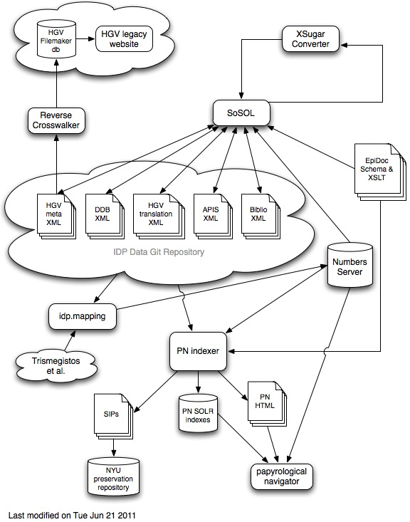

Top Level Data Flow
===================

Code referenced in the diagram
------------------------------

 * [Mapping](https://github.com/papyri/navigator/tree/master/pn-mapping)
 * [Indexing](https://github.com/papyri/navigator/tree/master/pn-indexer)
 * [PN View](https://github.com/papyri/navigator/tree/master/pn-dispatcher)
 * [SoSOL / Papyrological Editor](https://github.com/papyri/sosol)
 * [XSugar Standalone](https://github.com/papyri/xsugar)

(Taken from <http://idp.atlantides.org/trac/idp/wiki/TopLevelDataFlow>)
